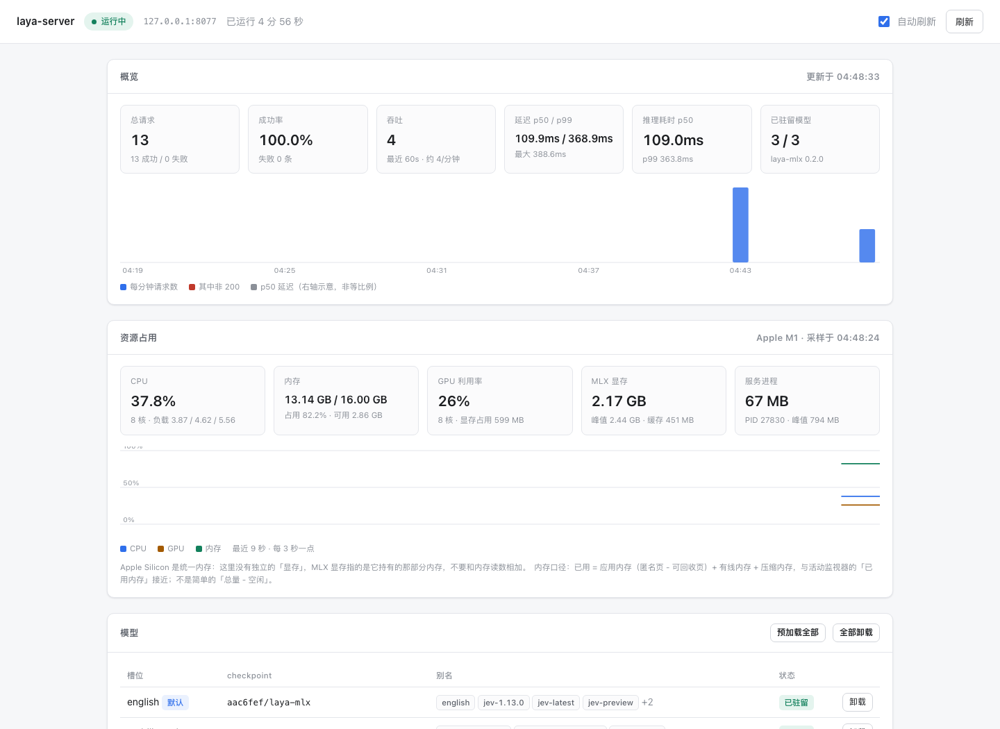

# laya-server

[](https://github.com/smarty-kiki/laya_server/actions/workflows/ci.yml)
[](LICENSE)


把 TypeSafe Jev 的 `POST /v1/systemone` 搬到本机。Apple Silicon 上用
[`laya-mlx`](https://pypi.org/project/laya-mlx/) 跑 Laya 的类型化决策模型，
**权重与推理全部在本机，0 次云端调用**。

```python
client = TypeSafeClient(base_url="http://127.0.0.1:8077", api_key="whatever")
```

改这一行，按 Jev 写的客户端就能继续跑。



*自带控制台，上图是真实运行状态：请求统计、资源占用、模型装载，一页全管，服务自己托管，零构建零依赖。*

---

## 为什么把这件事放到本机

| | 云端 Jev | 本机 laya-server |
| --- | --- | --- |
| 数据 | 原文要发到第三方 | **不出本机**。默认只监听 `127.0.0.1`，连局域网都不出 |
| 费用 | 按调用计费 | 一次性下 2.2GB 权重，之后免费 |
| 延迟 | 每次一个网络往返 | 热态 **约 120ms**（M1 实测，见下） |
| 离线 | 不可用 | **断网照常工作**，飞机上、内网里都能跑 |
| 客户端 | — | 零改动，只换 `base_url` |

除了「省事」，还有两件用起来才知道的事：

* **自带控制台**（`GET /`）。请求统计、模型装载、资源占用、改配置、优雅停机都在一页里，
  由服务自己托管 —— 不用装任何东西，也没有构建步骤。
* **macOS 上双击即用**。真的原生窗口（Dock 图标、菜单栏、⌘Q 都在），用系统自带的
  WebKit 渲染，**不需要装 Chrome / Safari**。

---

## ⚠️ 三条边界，先读

1. **这不是同一个模型。** 本机跑的是 Laya 的 MLX 移植（`aac6fef/laya-mlx` 等），
   与 TypeSafe 云端的 Jev **不是同一份权重**。JSON 形状逐字段一致，**概率不一致**。
   → 任何按 Jev 标定过的 `confidence` 阈值，**必须拿你自己的数据重新标定**。
   这不是保守猜测：`laya-mlx` 加载时就会打一条警告，说这份 checkpoint 的温度参数
   落在 `[0.5, 5]` 之外、会让部分桶的 confidence 失真，需要按「未标定」对待。
   响应里的 `model` 会如实回本地 checkpoint 的 id，不会伪装成 `jev-1.13.0`。
2. **中文要显式选模型。** Jev 和 Laya 的训练主语言都是英文，中日韩文准确率低
   （英文权重在非英语上不是平滑退化，是崩）。中文流量把 `"model"` 写成
   `laya-multilingual`，或者干脆写 `auto` 让它按 state 的语言自动挑。
3. **`output_tokens` 恒为 0。** 这是 System One 的定义，不是 bug。字段保留是为了让
   按 Jev 写的计量代码不至于 `KeyError`。

---

## 安装

```bash
cd laya_server
python3 -m venv .venv && .venv/bin/pip install -e ".[dev]"
```

想要 **macOS 原生窗口**（不依赖浏览器）再多一步：

```bash
.venv/bin/pip install -e ".[native]"
```

---

## 启动

**macOS 双击**（不想碰命令行）：

```bash
packaging/make_macos_app.sh        # 生成 ~/Applications/LayaServer.app
```

双击它：一个真正的原生窗口打开，里面就是控制台，服务已经在后面跑起来。

**命令行**：

```bash
.venv/bin/laya-console                     # 起服务 + 开窗口（默认行为）
.venv/bin/laya-console --auto-load all     # 顺便把没有的权重也下下来
.venv/bin/laya-console --no-native         # 用浏览器代替原生窗口
.venv/bin/laya-console --no-browser        # 只起服务
.venv/bin/laya-server                      # 只要 API，不要界面
```

**只要接口、连界面都不要**：`laya-server --port 8077`。

### 窗口的行为（这是个服务端应用，不是网页应用）

| 操作 | 结果 |
| --- | --- |
| 关窗口（红点 / ⌘W） | 只是把界面收起来，**服务照常跑**，脚本继续调 API |
| 点 Dock 图标 | 窗口回来 |
| 菜单栏的 `laya` 图标 | 打开控制台 / 在浏览器中打开 / 停止服务并退出 |
| ⌘Q 或菜单「停止服务并退出」 | 真正停服务并退出 |

**再双击一次不会起第二个服务** —— 会认出已经在跑的那个，直接把窗口连上去。

---

## 发第一个请求

```bash
curl -s http://127.0.0.1:8077/v1/systemone \
  -H 'Content-Type: application/json' \
  -d '{
    "state": "I have been trying to connect my Stripe account for 3 days and the integration keeps failing. I am losing sales. Please help ASAP.",
    "model": "jev-latest",
    "questions": {
      "department": {
        "type": "choice",
        "instructions": "Which team should handle this",
        "criteria": {
          "billing": "Payment or subscription issues",
          "technical": "Bugs or integration problems",
          "sales": "Pricing or account questions"
        }
      },
      "frustration": {
        "type": "score",
        "instructions": "How frustrated the customer appears",
        "criteria": ["Calm, just stating facts", "Frustrated but civil", "Very angry, strong language"]
      },
      "is_urgent": {
        "type": "noul",
        "instructions": "The message conveys urgency or time-sensitivity"
      }
    }
  }'
```

响应（字段名与 Jev 文档逐字一致）：

```json
{
  "model": "aac6fef/laya-mlx",
  "answers": {
    "department": {
      "type": "choice",
      "choice": "technical",
      "probabilities": {"billing": 0.15, "technical": 0.85, "sales": 0.0},
      "confidence": 0.78
    },
    "frustration": {
      "type": "score",
      "score": 1.0,
      "legend": {"0": "Calm, just stating facts", "1": "Frustrated but civil", "2": "Very angry, strong language"},
      "probabilities": {"0": 0.0, "1": 1.0, "2": 0.0},
      "confidence": 1.0
    },
    "is_urgent": {"type": "noul", "noul": 1.0}
  },
  "usage": {"input_tokens": 392, "output_tokens": 0}
}
```

### 接现成客户端

```python
# typesafe_sdk：只改 base_url
from typesafe_sdk import Choice, Noul, Score, TypeSafeClient

client = TypeSafeClient(base_url="http://127.0.0.1:8077", api_key="unused-or-whatever")
response = client.system_one(
    state="发票被重复扣款，请退款。",
    questions={"department": Choice(instructions="Which team should handle this",
                                    criteria=["billing", "technical", "sales"])},
)
print(response.answers["department"].choice)
```

更多例子在 `examples/`：`curl.sh`、`client.py`、`request.json`、`request_zh.json`。

---

## 该用哪个模型

| 槽位 | 默认 checkpoint | 用途 |
| --- | --- | --- |
| `english` | `aac6fef/laya-mlx` | 英文（Jev 别名都指到这里） |
| `multilingual` | `aac6fef/laya-multilingual-mlx` | 100+ 语言，**中文走这个** |
| `typed-decisions` | `aac6fef/laya-typed-decisions-mlx` | 特定工作流，**不会自动选中** |

`"model"` 可以填四种东西：

| 填什么 | 效果 |
| --- | --- |
| `jev-latest` / `jev-1.13.0` / `jev-preview` | 指向 `english`，兼容按 Jev 写的客户端 |
| `laya-multilingual` / `laya-typed-decisions` | 指向对应槽位 |
| `auto` | **按 state 的语言自动挑**：英文 → `english`，其余 → `multilingual` |
| `org/name` | 直接当 checkpoint id 加载 |

不确定就填 `auto`。想看它这次为什么这么选，启动时加 `--debug`，响应里会有 `debug.routing.reason`。

---

## 控制台

`GET /` 是一页自带的管理界面，服务自己托管，**零构建、零前端依赖**（顶部截图就是它）。

| 区块 | 能做什么 |
| --- | --- |
| **概览** | 总请求 / 成功率 / 吞吐 / p50·p99 延迟 / **纯推理耗时** / 已驻留模型数，附最近 30 分钟柱状图 |
| **资源占用** | CPU、内存、GPU 利用率、**MLX 显存**、服务进程内存，附走势图 |
| **模型** | 每个槽位的加载状态与别名；单个加载/卸载，或一键全加载/全卸载 |
| **最近请求** | 最近 1000 条：模型、问题数、答案类型、状态码、**总延迟与纯推理耗时分开列**、tokens、request id |
| **配置** | 表单由字段元数据生成；热改项立刻生效，冷改项写盘并标「重启生效」 |
| **进程** | 优雅停机 |

资源面板里最该看的数字是 **MLX 显存** —— 那是模型真实占用量。服务进程内存只有几十 MB
是正常的：权重在统一内存里以 GPU 缓冲形式存在，不计入进程 RSS。Apple Silicon 没有独立
显存，「MLX 显存」和「内存」是同一块物理内存的不同归属，**不要相加**。CPU 使用率需要
约 3 秒的采样窗，刚打开页面那一瞬间可能还没有数字。

---

## 配置

优先级：**命令行 > 环境变量（`LAYA_SERVER_*`）> 工作目录 `server.json` > `~/.laya-server/config.json` > 默认值**。

常用项：

| 参数 | 默认 | 说明 |
| --- | --- | --- |
| `--host` / `--port` | `127.0.0.1` / `8077` | 默认只对本机开放 |
| `--model` | `jev-latest` | 默认模型别名或 checkpoint id |
| `--api-key` | 无 | 设了就要求 `Authorization: Bearer <key>` |
| `--auto-load` | `local` | 启动时加载哪些权重，见下一节 |
| `--dtype` | `float16` | `float32` 数值更准、更慢更占内存 |
| `--batch-size` | `16` | 单次前向最多几个问题 |
| `--max-concurrency` | `1` | 同时推理数。MLX 是单设备，调高只在 IO 等待上有意义 |
| `--max-loaded` | `3` | 常驻权重数上限（LRU）。降到 1 省内存，代价是切语言时重载 |
| `--debug` | 关 | 响应附带路由、延迟等调试字段 |
| `--backend` | `mlx` | `echo` = 不加载权重的假后端，**只用于联调** |

`--preload` 是老写法，等价于 `--auto-load all`。

完整清单见 `server.example.json`，或启动后打开控制台的「配置」区 —— 那里每一项都带中文说明，
改完能直接看到「立即生效」还是「重启生效」。

用环境变量：

```bash
LAYA_SERVER_PORT=8077 LAYA_SERVER_AUTO_LOAD=all LAYA_SERVER_DTYPE=float32 .venv/bin/laya-server
```

需要改别名表或换本地权重目录时用配置文件（这两个是 map，环境变量表达不了）：

```json
{
  "port": 8077,
  "default_model": "jev-latest",
  "auto_load": "local",
  "max_loaded": 2,
  "aliases": {"jev-latest": "english", "laya-multilingual": "multilingual"},
  "slots": {
    "english": "aac6fef/laya-mlx",
    "multilingual": "aac6fef/laya-multilingual-mlx"
  }
}
```

配置会在启动时自检：别名指向不存在的槽位、`backend` 写错、`auto_load` 拼错，都会立刻报错，
不会拖到第一个请求才炸。

---

## 权重：下载、离线、启动加载

### 只下一次

权重落在 Hugging Face 缓存（`~/.cache/huggingface/hub`），三份合计约 2.2GB。
之后每次启动都是直接从磁盘读进内存，**网络不参与**。

| 场景 | 行为 |
| --- | --- |
| 有缓存 + 有网 | 直接用本地，不发网络请求 |
| 有缓存 + **没网** | 照常工作 ✓ |
| 没缓存 + 有网 | 正常下载 |
| 没缓存 + 没网 | 返回 503，报错里会写明「本地没有完整权重」并提示配镜像 |

不能直连 `huggingface.co` 时，配一个镜像端点（`"hf_endpoint": "https://hf-mirror.com"`），
或者把权重放到本地目录、再把 `slots` 指过去 —— 那种用法完全不涉及 Hugging Face。
代价是**不会自动检查新版本**；要拉更新，在控制台点对应模型的「加载」。

### 启动时自动加载本地已有的权重

`auto_load` 三档：

| 值 | 启动时做什么 | 适合 |
| --- | --- | --- |
| `local`（**默认**） | 把**本地已有完整权重**的槽位读进内存，**一个网络请求都不发** | 绝大多数情况 |
| `all` | 三个槽位全加载，本地没有的就去下 | 第一次部署，想一次把环境准备好 |
| `off` | 什么都不加载，全部等第一个请求 | 内存紧张，或这台机器只是偶尔被调用 |

默认选 `local`：既让第一个请求不吃冷加载，又不会让「打开应用」变成「悄悄下载 2GB」。
加载在**后台**进行，不挡启动 —— 窗口和服务立刻就绪，模型状态自己在控制台里长出来。
三份权重全在本地时实测约 **3.1 秒**全部就绪。

---

## 用自己的数据做后训练（微调）

出厂权重是通用英文场景。**你的分类法、你的置信度阈值，只能靠自己的数据喂出来**。
这件事不贵：出厂 checkpoint 本身就是一次 **1.96 小时 / 1 epoch / 单卡**微调的产物，
你的也不会贵多少。

两条路：

| | 路线 A：上游官方（PyTorch） | 路线 B：纯 MLX |
| --- | --- | --- |
| 工具 | 上游 [`laya`](https://github.com/NandhaKishorM/laya)（torch 2.x） | 本仓库现成的 `.venv` 就够 |
| 入口 | `notebooks/laya_finetune_typed_decisions_mps.py`（Apple GPU 可跑）<br>或 `notebooks/laya_finetune_typed_decisions_2xT4_kaggle.ipynb` | 自己写循环；模型就是标准 `nn.Module`，冻结编码器后单步不到半秒 |
| 闭环 | 建数据集 → RLCD 训练 → 温度标定 → 评估 → 导出，全在 notebook 里 | 参考下面三条 |
| 转换 | `laya-mlx convert --model <微调产物> --output <目录>` | 不用转，照 `laya_mlx/convert.py` 写盘 |

训出来的 checkpoint 指到 `slots` 就能用：

```json
{"slots": {"english": "/path/to/你的微调产物"}, "aliases": {"jev-latest": "english"}}
```

三条不能错的事：

1. **prompt 构造必须复用 `laya_mlx.common.build_sequence`** —— 自己拼字符串等于在另一个分布上训练。
2. **写回格式照抄 `laya_mlx/convert.py`** —— 参数名一个不能错，加载是严格校验的。
3. **训完必须重新标定温度**（写回 `rl_agent_config.json` 的 `temperature_by_options`），
   否则 confidence 还是「未标定」状态。

**数据是唯一的瓶颈**（真实权重实测）：6 条标注能把训练集拟合到 100%，但留出集会从 33%
**掉到 0%** —— 灾难性过拟合。**500 条起步、几千条像样**，且必须留验证集；
数据不够时解冻编码器只会更糟。

---

## 接口

| 方法 | 路径 | 说明 |
| --- | --- | --- |
| POST | `/v1/systemone` | Jev 兼容主端点 |
| GET | `/` | 控制台页面 |
| GET | `/v1/models` | 本地别名 → 槽位 → checkpoint，以及哪些已驻留 |
| GET | `/healthz` | 存活 + 模型状态 + uptime + 累计请求数 |
| GET | `/docs` | OpenAPI（`--no-docs` 关掉） |
| GET/PUT/DELETE | `/admin/*` | 控制台用的管理接口，**默认只接受本机来源** |

额外响应头（Jev 没有，纯附加）：`X-Request-Id`、`X-Laya-Latency-Ms`、`X-Laya-Inference-Ms`。

### 错误码

| 状态 | 何时 | 错误码 |
| --- | --- | --- |
| 401 | 设了 `--api-key` 但 `Authorization: Bearer` 不对 | `unauthorized` |
| 422 | 请求体不合法（选项超 255、score 等级不在 2–10、`model` 不存在…） | `invalid_request` / `unknown_model` |
| 429 | 等推理槽位超时（`max_concurrency` 满了） | `too_many_requests`，带 `Retry-After` |
| 503 | 权重下载或构建失败 | `model_unavailable` |

错误体是 `{"error": {"code": "...", "message": "..."}, "detail": [...]}`，
`detail` 是逐字段的校验信息。

### 三种问题类型

| `type` | `criteria` | 答案字段 |
| --- | --- | --- |
| `choice` | 对象，键是选项名，值是描述（可为 `null`）。上限 **255** 项 | `choice`、`probabilities`、`confidence` |
| `score` | 有序数组，**2–10** 个等级 | `score`、`legend`、`probabilities`、`confidence` |
| `noul` | 可选 `{"true": ..., "false": ...}` | `noul`（0–1） |

`instructions` 和 `criteria` 的值可以是字符串、对象或数组，会原样透传给模型。

---

## 打包成 macOS App

两种产物，用途完全不同：

| | `make_macos_app.sh` | `build_macos.sh` |
| --- | --- | --- |
| 产物 | **薄壳**：20KB，指向本仓库的 `.venv` | **独立包**：275MB，自带 Python |
| 给谁用 | 自己 | **别人**——换台机器照样跑 |
| 耗时 | 秒级 | 约 2 分钟 |

```bash
packaging/make_macos_app.sh              # 薄壳 → ~/Applications/LayaServer.app（秒级）
.venv/bin/pip install -e ".[packaging,dev]"
packaging/build_macos.sh                 # 独立包 → dist/LayaServer.app
packaging/build_macos.sh --dmg           # 顺带生成 .dmg
```

独立包里 **自带 Python 和全部依赖**，对方什么都不用装；模型权重不在包里，首次使用从
Hugging Face 下载（约 2.2GB）。MLX 原生件按原样拷贝进包里、不做重打包
（原因写在 `packaging/laya_server.spec` 的注释里）。本机实测：

| 项 | 实测 |
| --- | --- |
| 产物大小 | 275MB |
| 双击启动 → 服务就绪 | 约 0.5s |
| 热态推理 | **0.12s**，与开发版逐字段相同的答案 |
| 依赖本机 Python / 本仓库 | **没有** |

打包完跑一次冒烟，确认它真的能干活：

```bash
packaging/smoke_app.sh --mlx     # 真加载权重、真跑推理，并卡延迟上限
```

要**通过网络**分发给别人，需要 Apple Developer ID 签名 + 公证，否则 Gatekeeper 会拦
（提示「已损坏」—— 那其实是没签名，不是真坏了）：

```bash
MAC_SIGN_ID="Developer ID Application: 你的名字 (TEAMID)" \
NOTARY_PROFILE=你的钥匙串条目 \
packaging/build_macos.sh --dmg
```

不管走哪条路，三条都躲不掉：**必须 Apple Silicon**（MLX 只有 arm64 构建）、
**macOS 14+**、**首次要下 ~2.2GB 权重**（国内基本要配 `hf_endpoint` 镜像）。

### 应用图标

母版是 `assets/icon/laya-server-icon-1024.png`（1024 满幅方图）。`make_icon.py` 负责
把它变成能用的 `.icns` —— macOS 不会像 iOS 那样自动给图标加圆角遮罩，所以「824 图标体
＋连续曲率圆角＋居中留白」这一层必须画进图里，否则 Dock 里就是个方角黑块：

```bash
.venv/bin/python packaging/make_icon.py            # → packaging/LayaServer.icns
.venv/bin/python packaging/make_icon.py 别的图.png   # 换一张母版重新生成
```

生成的 `packaging/LayaServer.icns` 已随仓库提交，两个打包脚本都直接引用它。
`build_macos.sh` 每次打包前会重新生成一遍（保证跟母版同步）；`make_macos_app.sh`
**不会** —— 它要保住「零额外依赖、秒级完成」，而重建图标需要 Pillow。
改了母版就手动重跑一次上面那行。

---

## 常见问题

**第一次请求很慢？**
权重还没进内存。默认 `auto_load: local` 会在启动时就把本地已有的权重读起来（后台约 3 秒），
所以正常情况下第一个请求也是快的。本地还没有权重时，第一次要下 2.2GB ——
控制台的「模型」区能看着它涨。

**空闲几十秒之后的第一发要 300–450ms，后面又回到 120ms？**
这是 **macOS 的内存压缩器**，不是服务的问题：系统把进程里久没用到的冷页面压缩了，
第一发请求要把约 1.1GB 解压回来（实测可复现，解压完立刻恢复 120ms）。
它会被算进「纯推理耗时」里，所以控制台两列都看不出来。只影响隔几十秒的第一发；
真要压掉就把 `max_loaded` 改成 `1`（只常驻你在用的语种），代价是切语言时重载。

**返回 503 说是 `model_unavailable`？**
权重没下下来。报错信息会区分「本地没有完整权重」（配 `hf_endpoint` 镜像或手动放权重）
和「下载本身失败」（看网络）。

**中文结果不准？**
把 `"model"` 改成 `laya-multilingual` 或 `auto`。别用 `jev-latest` 处理中文。

**能直接拿 `confidence` 做门控吗？**
**不能。** 见开头第 1 条。要用就先拿你的数据标一遍，做法见「用自己的数据做后训练」。

**端口被占？**
`laya-console` 会自动往后找一个空闲端口并在日志里说明。想让它直接失败用 `--strict-port`。

**关掉窗口服务还在跑？**
这是设计：窗口只是界面，服务是服务（脚本也在用它）。要真停就 ⌘Q，或者用控制台的「停止服务」。

**双击 App 没反应？**
先看日志，它在 `~/.laya-server/app.log`（超过 2MB 自动轮转）。两种 `.app` 都把输出写在那儿。
也可以直接跑可执行文件，错误会打在终端里而不是消失：

```bash
~/Applications/LayaServer.app/Contents/MacOS/launch    # 薄壳版
dist/LayaServer.app/Contents/MacOS/laya-console        # 独立包版
```

**`--host 0.0.0.0` 之后，隔壁同事能改我的配置吗？**
不能。`/admin/*` 默认只接受回环地址来的请求，管理面不会跟着监听地址一起暴露。
真要放开就改 `admin_local_only`，但那等于把这些权限交出去。

**同事能直接用我机器上跑着的这个服务吗（而不是自己装一份）？**
可以，两步：你的服务监听局域网，并设一个 API Key ——

```bash
.venv/bin/laya-console --host 0.0.0.0 --api-key 换一个够长的随机串
```

然后对方把 `base_url` 指到 `http://<你的局域网 IP>:8077` 即可，代码一行不用改。
管理面仍然只接受你本机的请求，所以对方能用推理接口、改不了你的配置。
连不上先看 macOS 防火墙有没有拦入站连接。

---

## 性能参考

Apple M1 / 16GB / 三份权重全部驻留（约 2.2GB）实测：

| 项 | 数字 |
| --- | --- |
| 进程启动到 `/healthz` 可用 | 约 0.4s |
| 启动后台把三份本地权重读进内存 | 3.1s |
| 首个请求（权重已驻留） | 0.32s |
| **热态请求 p50（连续）** | **120ms** |
| 连续 60 发的分布 | 117–179ms，中位 122ms，无离群 |
| 空闲 40 秒后的第一发 | 380–450ms（macOS 解压冷页面，见「常见问题」） |
| 常驻内存（3 份权重） | MLX 显存约 2.2GB |

控制台里**总延迟**和**纯推理耗时**是分开的两列：差距大说明在排队，差距小说明时间
都花在推理上 —— 这是判断「为什么变慢」的第一刀。

---

## 与 Jev 的差异

| 项 | Jev | 本服务 |
| --- | --- | --- |
| 后端 | 云端 | 本机 MLX |
| `model` 响应值 | `jev-1.13.0` 这类服务端版本 | 本地 checkpoint id |
| 权重 | 官方 Jev | Laya MLX 移植，**不同权重** |
| 单 answer 上的 `action.act_probability` | 无 | 默认剔除，`--debug` 时保留 |
| noul answer 上的 `confidence` | 无 | 默认剔除，`--debug` 时保留 |
| `/v1/models`、`/healthz` | 无 | 有（附加，不影响兼容） |
| 529 Overloaded | 有 | 归到 429（本地排队超时） |

默认响应**逐字段**与 Jev 一致：`{"model", "answers", "usage"}`，一个不多一个不少。

---

## 开发

```bash
.venv/bin/python -m pytest -q          # 161 个测试，离线可跑，不下载任何权重
```

CI（`.github/workflows/ci.yml`）在 macOS 上对 Python 3.11 / 3.12 / 3.13 各跑一遍同一套
测试 —— 同样的离线测试，不下载权重。

模型准不准不在测试里量 —— 那要用真实权重和真实样本量去跑，而且得用你自己的数据。

---

## 许可

Apache-2.0（全文见 [LICENSE](LICENSE)）。Laya 权重与上游 prompt 构造来自 Convai Innovations 及贡献者；
`laya-mlx` 是独立 MLX 移植，非 Convai 官方发布。
